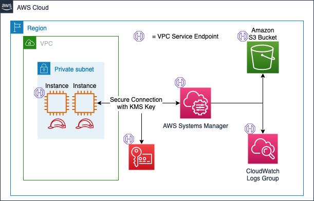

## AWS Systems Manager Session Manager

[Session Manager](https://docs.aws.amazon.com/systems-manager/latest/userguide/session-manager.html) is a fully managed AWS Systems Manager capability. With Session Manager, you can manage your Amazon Elastic Compute Cloud (Amazon EC2) instances, edge devices, and on-premises servers and virtual machines (VMs). You can use either an interactive one-click browser-based shell or the AWS Command Line Interface (AWS CLI). Session Manager provides secure and auditable node management without the need to open inbound ports, maintain bastion hosts, or manage SSH keys. Session Manager also gives teams the ability to centralize logging for connections made to your nodes or the actions that were taken on them. 

### Setting up Session Manager

The process for [setting up Session Manager](https://docs.aws.amazon.com/systems-manager/latest/userguide/session-manager-getting-started.html) is simple, so long as your team is using an EC2 AMI that has the SSM agent preinstalled.  If your are using in AMI that does not have the SSM agent preinstalled, you can install it following [these instructions](https://docs.aws.amazon.com/systems-manager/latest/userguide/sysman-manual-agent-install.html). Below is the Terraform code required to create an AWS Role for an EC2 Instance Profile, create an EC2 instance and attach that profile, and send SSM Session manager logs to a CloudWatch Logs group for analysis. 



#### What does this module accomplish? 

This Terraform module creates the required AWS resources to establish secure connection to an EC2 instance over HTTPS rather than SSH.  This solution can be tailored and scaled to meet the needs of all organizational structures and sizes.  This module also gives teams the flexibility to interact with clients in a private subnet leveraging VPC endpoints to interact with AWS Systems manager.  

### Steps for Deployment

#### Clone the repository

1. Copy the link (SSH or HTTPS) for the git repo and navigate to your local directory on your machine.  In the terminal, run `git clone <clone-link>` to clone the contents of this module. 

#### Create your Terraform variables
2. Create a file called `terraform.tfvars` to store your variables for the module.  Your file will look something like this: 
```
private_subnet = boolean
vpc_id = string
subnet_id = string
ami = string
instance_type = string
ssm_role = string
team = string
security_group = string
s3_bucket = string
s3_log_bucket_id = string
tags = map(string)
```
**IMPORTANT** - This is where you will determine if your EC2 will have a public IP assigned to it or not.  If you're deploying the instance in a private subnet set the `private_subnet` variable to `True`.  If you want to consume this module with a public IP address associated with your EC2 instance set the variable to `False`. 

#### Apply these changes to your environment

3. Once you've made the changes to your variables, run `terraform plan`. This will give you a snapshot of the resources that will be created in your account. 

4. Once you validate the resources listed in the plan are accurate, run `terraform apply --auto-approve` to apply those changes in your environment.  


### Enable settings for Session Manager in Systems Manager

You can apply these settings either through the AWS console, or via Terraform: 
* Option 1 (PREFERRED): You can configure your account settings for Session Manager through the AWS Console.  There are limitations to updating the preferences in Terraform, so we recommend following the steps to complete this in the console. If leveraging the S3 bucket and CloudWatch log group created in this module, configure those portions of the preferences after deployment. 

Enable settings through the console: 
1. In the AWS Console, navigate to "AWS Systems Manager".
2. On the left navigation pane, select "Session Manager".
3. Select the "Configure Preferences" tab and click "edit".
4. Add the S3 bucket and CloudWatch log group as destinations for session manager logs. Also select the newly created KMS key for session encryption using KMS. (If you are creating a new group as 
part of this Terraform template, you will need to perform this step after running Terraform apply)
5. Click "Save".

* Option 2: Enable settings in Terraform: 
- Add a new file to your repository called `ssm-prefs.tf`. Add the following contents to that file, and follow the same steps as above to apply the changes to the environment.  If you follow this path, it is recommended that you lock down the ability of users to modify these settings in the console. 

```json
resource "aws_ssm_document" "session_manager_prefs" {
  name            = "SSM-SessionManagerRunShell"
  document_type   = "Session"
  document_format = "JSON"

  content = <<DOC
{
    "schemaVersion": "1.0",
    "description": "SSM document to house preferences for session manager",
    "sessionType": "Standard_Stream",
    "inputs": {
        "s3BucketName": "${aws_s3_bucket.ssm_s3_bucket.id}",
        "s3KeyPrefix": "AWSLogs/${data.aws_caller_identity.current.account_id}/ssm_session_logs",
        "s3EncryptionEnabled": false,
        "cloudWatchLogGroupName": "${aws_cloudwatch_log_group.ssm_logs.name}",
        "cloudWatchEncryptionEnabled": false,
        "runAsEnabled": false,
        "kmsKeyId": "${var.ssm_kms_key_id}",
        "cloudWatchStreamingEnabled": true,
        "idleSessionTimeout": "20"
    }
}
DOC
}
```

### Test the Solution

1. Navigate to the EC2 console and check the box next to the Instance you want to connect to.  Select 'Connect' and then choose "Session Manager". 

*NOTE*- If you see errors on this page, go into the Session Manager preferences within the AWS Systems Manager service and ensure the KMS key, Log Group and S3 Bucket are all established. 

2. Once logged into the EC2 instance, type `echo "testing connection and logging capabilities of session manager"`. 
3. Click "Terminate". 
4. Navigate to the newly created log group and select the Log Stream that was created from the creation of a session. You can see the log metadata and the command above is outlined in the log stream. 
5. Navigate to the newly created S3 Bucket. You can open that log file and see a similar pattern with the above command. 

## Security

See [CONTRIBUTING](CONTRIBUTING.md#security-issue-notifications) for more information.

## License

This library is licensed under the MIT-0 License. See the LICENSE file.

